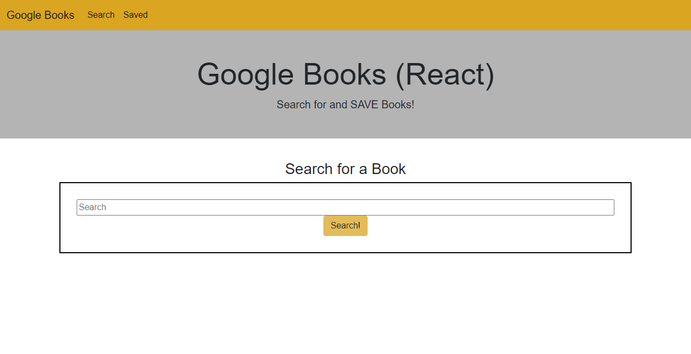

# Clicky

----------------------

## Table of Contents

[Description](#Description) |
[Deployed Link](#Deployed-Link) |
[Prerequisites](#Prerequisites) |
[Technologies](#Technologies-Used) |
[Website Image](#Website-Image) |
[Code Snippet](#Code-Snippet) |
[Authors](#Authors) |
[License](#License) |
[Acknowledgements](#Acknowledgements) |

## Description

Application uses Google Books API to search for a book and save it to a Mongo Database


## Deployed Link

[Link](https://react-googlebooksapi-search.herokuapp.com/)

## Prerequisites

None

## Technologies Used

- Javascript
- CSS
- JSX
- React
- NodeJS
- MongoDB
- HTML

## Website Image



## Code Snippet

Showcased are the functions we used to interface the api and save the selected items to our database

```Javascript
const handleSubmit = function  handleSubmit() {
    API.googleSearch(tpying.searchTerm).then(function (results) {
        console.log("results ========>", results.data.items)
        setBooks({
            ...books,
            bookList: results.data.items,
        });
    });

const handleSave = function handleSave(bookData) {
    API.saveBook(bookData);
        console.log("bookData ======>", bookData)
        console.log("button clicked");
        setSaveBooks({
            ...saveBooks,
            savedBooks: bookData
        });
}
```

## Authors

1. **William W. Bryan**

- [Github](https://github.com/WeiLiBryan)
- [LinkedIn](https://www.linkedin.com/in/william-bryan-72730019a/)

2. **Spencer Christy**

- [Github](https://github.com/spenrad)
- [LinkedIn](https://www.linkedin.com/in/spencer-christy/)

3. **Abuye Mamuye**

- [Github](https://github.com/AbuyeM1)
- [LinkedIn](https://www.linkedin.com/in/abuye-mamuye-5a49921b0/)

## License

[](https://opensource.org/licenses/MIT)

## Acknowledgements

- [Stack Overflow](https://stackoverflow.com)
- [w3schools](https://w3schools.com)

### [Back to Table of Contents](#table-of-contents)